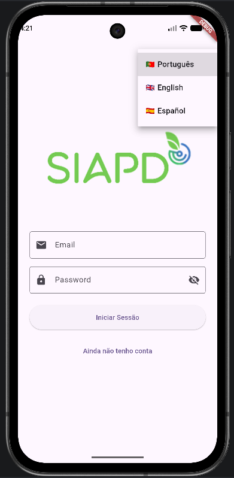
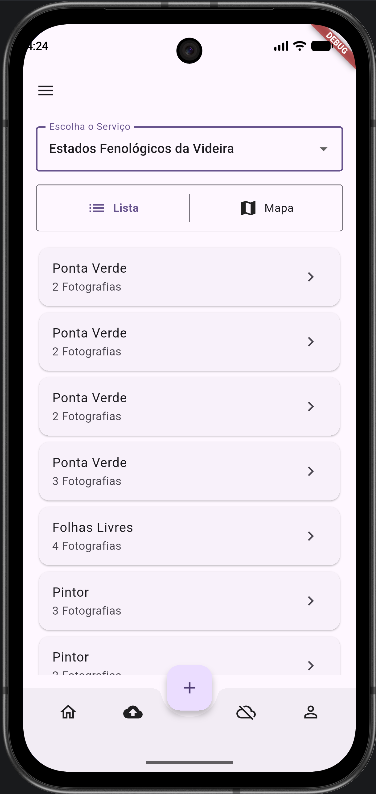
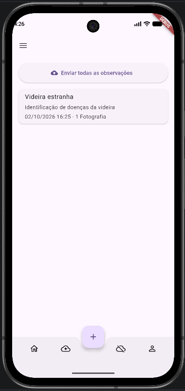

SIAPD is a Flutter mobile application developed for field data collection in agriculture and viticulture. It supports offline observations, image collection, geolocation, user authentication, and synchronization with the mySense API.

The application was redesigned from an older version with a cleaner architecture, local data storage, multilingual support, and improved offline capabilities.

   
